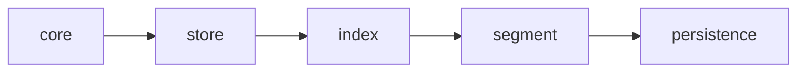

# vexdb

A segmented vector database for Approximate Nearest Neighbor search, written in C++20. Uses AVX2 SIMD distance kernels, HNSW graph indexing, and memory-mapped storage.

Vectors are written to an active in-memory segment, sealed to disk when full, and served as read-only mmap-backed segments. Search fans out across all segments and merges results.

## Architecture



| Layer | Contents |
|---|---|
| **core** | types, L2 distance (AVX2 + scalar, compile-time dispatch), SQ8 quantization |
| **store** | VectorStore concept, InMemoryStore, MmapStore |
| **index** | HnswIndex\<Store\>, FlatIndex\<Store\> |
| **segment** | ActiveSegment, SealedSegment, SegmentManager |
| **persistence** | Serializer, Loader, VEX0/HNSW/IDS binary formats |

Templates live in `store/` and `index/`. Everything from `segment/` up exposes only concrete types.

See [docs/PRD.md](docs/PRD.md) for the full design rationale.

## Code style

Code follows STL/snake_case naming convention: types in `PascalCase`, functions and variables in `snake_case`, namespace `vexdb` in lowercase.

## Build

Requires CMake 3.20+, a C++20 compiler (GCC 14+ or Clang 18+).

```bash
cmake -B build -DCMAKE_BUILD_TYPE=Release
cmake --build build
```

Run tests and benchmarks:

```bash
ctest --test-dir build --output-on-failure
./build/benchmarks/vexdb_bench
```

### Python bindings (optional)

Requires Python 3.8+ and NumPy.

```bash
cmake -B build -DCMAKE_BUILD_TYPE=Release -DVEXDB_BUILD_PYTHON=ON
cmake --build build
PYTHONPATH=build/python python3 -c "import vexdb; print('ok')"
```

## Usage

### C++

```cpp
#include <vector>
#include "segment/segment_manager.h"

// In-memory only
vexdb::SegmentManager db(/*dim=*/768, /*segment_capacity=*/1000000);

// Insert
std::vector<float> vec(768, 0.0f);
db.insert(/*user_id=*/42, vec.data());

// Search
std::vector<float> query(768, 1.0f);
auto results = db.search(query.data(), /*k=*/10);
for (const auto& r : results) {
    // r.user_id, r.distance
}

// With persistence
vexdb::SegmentManager db2(768, 1000000, "path/to/db");
db2.insert(42, vec.data());
db2.save();
auto loaded = vexdb::SegmentManager::load("path/to/db");
```

### Python

```python
import numpy as np
import vexdb

db = vexdb.Database(dimensions=768, segment_capacity=1_000_000, path="path/to/db")

db.insert(user_id=42, vector=np.random.randn(768).astype(np.float32))

results = db.search(query=np.random.randn(768).astype(np.float32), k=10)
for user_id, distance in results:
    print(f"  {user_id}: {distance:.4f}")

db.save()
db2 = vexdb.Database.load("path/to/db")
```

## Benchmarks

Release build, single-threaded. Selected results from local runs:

| | Time |
|---|---|
| L2 distance (scalar, 128d) | 43 ns |
| L2 distance (AVX2, 128d) | 9 ns |
| L2 distance (AVX2, 768d) | 80 ns |
| SQ8 asymmetric (AVX2, 768d) | 123 ns/vector |
| FlatIndex search (10K, 128d) | 163 μs |
| HNSW search (10K, 128d) | 39 μs |
| HNSW search (100K, 128d) | 145 μs |

HNSW is 4.2x faster than brute-force at 10K vectors. At 100K, HNSW search time grows sub-linearly (39 μs → 145 μs for 10x more vectors).

## Project status

v0.1 — MVP. Single-node, single-threaded. See [milestones](https://github.com/mariorch22/vexdb/milestones) for the roadmap.

## License

MIT
